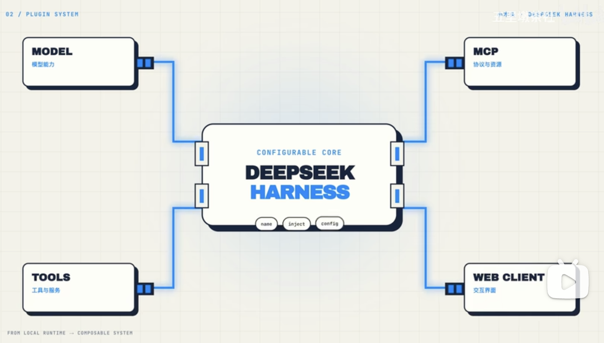

# DeepSeek Harness 

DeepSeek 最近发布了Harness, 很快来到了10w+ star。

https://github.com/deepseek-ai/deepseek-harness

## Harness 是什么?

马具？ 

不是新模型， 是包在模型外面的整套运行框架。

Agent = llm + harness(tool+rag+skill+mcp...)

模型负责理解问题/规划下一步，harness负责 准备工具， 保存会话， 管理文件权限， 再把结果送回模型。

所以他和聊天网页不是一回事。

你让它检查一个项目， 它要先找到文件，决定调用什么工具， 拿到结果再执行。
中间哪一步可以执行， 哪一步要停下来问你，也属于这套框架负责的范围。

这套框架很有意思的地方是很多能力都可以拆开来组合。

## 插件

模型接入是一块， 工具是一块， 会话和界面也是各自的一块， 需要什么就装进来， 不需要什么就拿掉。

不是把很多东西都写死在一个应用里，这也是这个项目最有名的概念。

启动时， 先拿一套现成配置打底，再换上自己的模型， 工具， 设置， 用网页， 还是不带界面的命令行，
运行却别主要在这些核心配置， 核心并没有换。

## 开发者意义

这对开发者的意义很直接，换模型提供方，或者增加新工具， 不用重做应用。
这是harness 给于的灵活性， 不代表每一种组合都稳定。

## 启动harness

- node --version
Node 22.19.0 以上
先升级

### mac 安装
curl -o- https://raw.githubusercontent.com/nvm-sh/nvm/v0.40.1/install.sh | bash
source ~/.zshrc

### windows 安装 
https://github.com/coreybutler/nvm-windows/releases

nvm install 24.0.0
nvm use 24.0.0

### 安装

npx @deepseek-ai/dsh web
会得到一个地址， 打开 

模型设置， 你要用的模型 

- 选择一个工作目录
桌面 tmp,  既看得到结果， 也不会碰到个人的一些文件（权限控制）

### 读源代码
可以尝试从仓库启动， 依赖， 构建， 打开网页

## 插件 plugin


deepseek 基于cordis , 

Cordis 是一个插件化框架，用「服务 + 上下文 + 生命周期」那套机制，让程序能像搭积木一样挂载、组合、卸载插件（Koishi 机器人就是基于它）。

插件本质上是一个接收Context 的函数，它申明自己依赖哪些服务， 在context 上注册新的能力，在卸载时让框架统一清理。

模型、会话、工具，web界面，都可以沿着扩展边界， 接入harness。

### 一个插件，最少需要什么？

hello world 

1. 可以被加载的模块入口
让Harness 找到插件
2. 一个apply函数
接收context并注册能力
3. Config Schema
让配置可检验可展示

```
export const name = 'hello'

export function apply(ctx:Context) {
  ctx.tools.add({ // 注册能力
    name: 'hello',
    execute: ({name}) => `Hello ${name}`
  })
}
// 让配置可检验可展示
export const Config = Schema.Object({})
```
